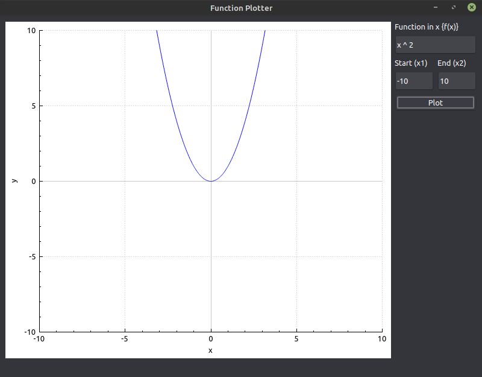

# Function Plotter 
## Screenshots
### Working Examples

### Wrong Examples

## `MathUtil` class
### Public Methods
#### `static long double substituteIntoFunc(const QString &function, const QString &variableName, const long double &variableValue)`
Substitute into some mathematical function provided as string, you should provide the mathematical variable name and the value of that variable. It returns a long double after evaluating that mathematical expression.

> **Warning**
>
> Insure that `QString &function` parameter does NOT include any spaces. 
#### `static QStringList splitMathematicalExpression(QString mathematicalExpression)`
Convert a string mathematical expression into a list.
### Private Methods
#### `static int getIndex(const QStringList &haystack, const QVector<QString> &needles)`
Get the index of the first existent needle from `needles` in `haystack`.
#### `static bool isdouble(const QString &str)`
Check if the provided string `str` is double or not and return `true` if it's and `false` if it's not.
#### `static long double stringNumberOrVariableToLongDouble(const QString &numberOrVariable, const QString &variableName, const long double &variableValue, bool &error)`
Convert string number (e.g. `"-10.5"`) or mathematical variable (e.g. `"x"`) to a `long double`. If it's string number, it returns it as `long double`. But if it is a mathematical variable, it returns the variable value that is provided as a parameter in this function.  
